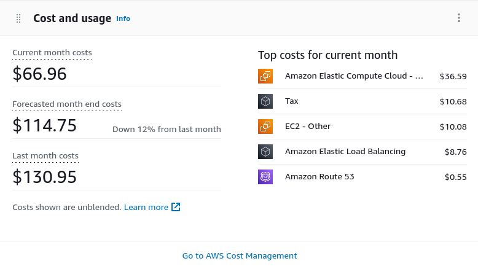
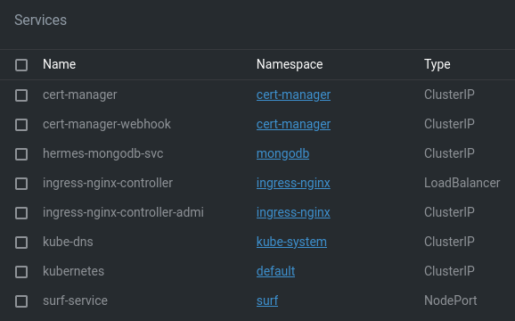

+++
title = 'Home'
background = 'wave-1920x1080.jpg'

[content]
  [[content.pages]]
    headline = 'SurfBuddy'
    id = 'surfbuddy'
    image = 'watchface.png'
    image-right = true
    link_info = 'Support me and the watchface.'
    # page_content = 'home/surfbuddy.md'
    page_content = """
The **Surfbuddy** watchface is a newly designed watchface for surfing information. It's design and displayed information is inspired by [my most favorite watchface](https://apps.garmin.com/en-US/apps/d819f156-de65-41c6-8c97-26b997546460) which was discontinued in August 2021.

A lot of people like me were sad about this and kept writing into the comments desiring the return of this great app.
Since then I worked from time to time on a new watchface that resembles it.

"""
    [[content.pages.buttons]]
      label = 'Download'
      href = 'https://apps.garmin.com/en-US/apps/ad6f857d-2f85-4551-885c-d5efa1fb0e3c'
    [[content.pages.buttons]]
      label = 'Support me'
      href = 'https://www.buymeacoffee.com/JanSurft'
    [[content.pages.buttons]]
      label = 'Feedback'
      href = 'https://surfbuddy.hellonext.co'
  [[content.pages]]
    headline = 'Support matters!'
    id = 'support-matters'
    # image = 'watchface.png'
    # image-right = true
    centered = false
    # page_content = 'home/surfbuddy.md'
    page_content = """
There was one reason why the original surfing watchface could no longer be supported: The responses from the surfline API were getting too big, exceeding the size limitations for HTTP requests from the garmin watch.

I fixed this problem by running [my own server infrastructure](#how-does-it-work) with a caching database that allows two things:

1. **Keeping the impact of requests to the surfline API low**
2. **Allowing for tailor cut responses for the garmin watch that are very size efficient**

This even allows me to run this watchface on low memory device like the Garmin Instinct S which was not supported by the original watchface.

Running this infrastructure though, comes at a price: 
The SurfBuddy API must handle several thousands of requests from all over the globe and allow timely and reliable responses. To achieve that, I set up a Kubernetes Cluster on AWS server infrastructure. This includes three virtual PCs and enough dataspace to cache several Gigabytes of forecast requests.

**Currently I'm paying roughly 110-130$ per month** for the server infrastructure depending on how many users are using the service. This easily exceeds all the donations that were ever done for the watchface. And this does not include the hours that I spent fixing and developing feautures for the watchface.

For the SurfBuddy API to run reliably and accessible from all over the world I need a bunch of services run on the cluster:

What are all these services?

- **cert-manager:** Garmin watches require API access via HTTPS, so the API needs a HTTPS certificate which I get via [Let's Encrypt](https://letsencrypt.org/), for it not to run out every three months I have a certificate manager running.
- **hermes-mongodb-svc:** For caching I need a database to temporarily store requested data, I have a mongodb replica set for fast and reliable queries.
- **ingress-nginx-controller:** The SurfBuddy API needs to be accessible from the internet via a domain name, the ingress-nginx-controller manages to forward API requests to the correct Kubernetes service.
- **surf-service:** The actual Surfbuddy API that is getting the requests from all the garmin watches all over the world.
- **kube-dns / kubernetes:** Kubernetes related internal services.

If all the users would share the costs to run these services we could get off with several cents a month, depending on how many users would participate in a monthly donation.

**A Labor of Love:**

SurfBuddy was born from my passion for surfing and a desire to enhance the experience for fellow enthusiasts. Countless hours were poured into crafting a watch face that seamlessly combines functionality and aesthetics. By supporting SurfBuddy, you acknowledge the effort behind its creation and contribute to sustaining a project fueled by dedication and love for the sport.

**Accessible and Free:**

SurfBuddy is offered free of charge to the marine community. It's my intention to make this invaluable tool accessible to all, regardless of financial limitations. Your support helps maintain this commitment, ensuring that SurfBuddy remains freely available for everyone.

**Long-Term Sustainability:**

Every donation towards supporting SurfBuddy directly contributes to its long-term sustainability. It covers server and database expenses, ensuring the watch face remains functional, reliable, and up-to-date. Your support safeguards the future of SurfBuddy, benefiting both yourself and others.
"""
    [[content.pages.buttons]]
      label = 'Support me'
      href = 'https://www.buymeacoffee.com/JanSurft'
  [[content.pages]]
    headline = 'Feedback'
    id = 'feedback'
    image = 'surfbuddy-feedback.png'
    image-right = true
    link_info = 'Submit your ideas and encountered bugs'
    page_content = """
There is a dedicated [feedback page](https://surfbuddy.hellonext.co) allowing you to provide new ideas and submit bug reports for SurfBuddy. Depending on the votes that single bugs and features will get over time, I will try to plan and work on the most desired ones.
"""
    [[content.pages.buttons]]
      label = 'Feedback'
      href = 'https://surfbuddy.hellonext.co'

  [[content.pages]]
    headline = 'How does it work?'
    id = 'how-does-it-work'
    image = 'surfbuddy-arch-narrow.png'
    page_content = """
The watchface gets the forecast information from the **SurfBuddy API** that caches and transforms forecast responses from external services. At the moment this is mostly [Surfline](https://www.surfline.com/) in combination with a [GeoDB Cities API](http://geodb-cities-api.wirefreethought.com/) location service.

The SurfBuddy API is crucial, because responses from forecasting services do not adhere to the limited size requirements of the Garmin watchfaces.
"""
  [[content.pages]]
    headline = 'Install SurfBuddy'
    id = 'install-surfbuddy'
    image = 'surfbuddy-install.gif'
    image_class = 'phone'
    image_bg = 'phone-background-solid.png'
    image-right = true
    link_info = 'Learn more about the usage of the watchface'
    page_content = """
Install *SurfBuddy* via the *ConnectIQ* mobile App.

The following sequence of actions and the GIF animation describe how its done:
"""
    [[content.pages.buttons]]
      label = 'More about usage'
      href = '/usage/'
    [[content.pages.items]]
      content = 'open connect IQ app'
    [[content.pages.items]]
      content = 'select "Search"'
    [[content.pages.items]]
      content = 'In the search field enter "surfbuddy"'
    [[content.pages.items]]
      content = 'Select the watchface from the list of results'
    [[content.pages.items]]
      content = 'Select "Install"'
    [[content.pages.items]]
      content = 'Click on "Allow" for the app requirements'
  [[content.pages]]
    headline = 'Set Surf Spot'
    id = 'set-surf-spot'
    image = 'surfbuddy-set-spot.gif'
    image_class = 'phone'
    image_bg = 'phone-background-solid.png'
    image-right = true
    link_info = '...'
    [[content.pages.items]]
      content = 'open connect IQ app'
    [[content.pages.items]]
      content = 'select "My Device"'
    [[content.pages.items]]
      content = 'select "My Watch Faces"'
    [[content.pages.items]]
      content = 'select "SurfBuddy"'
    [[content.pages.items]]
      content = 'select "Settings"'
    [[content.pages.items]]
      content = 'change the "Spot name" attribute'
    [[content.pages.items]]
      content = 'select "Save"'
  [[content.pages]]
    headline = 'FAQ'
    type = 'faq-static.html'
    id = 'faq'
    image = ''
    [[content.pages.questions]]
      question = 'Which spotnames can be used?'
      answer = 'Currently the watchface is using surfline for forecast information, so any spotname that is listed there works for SurfBuddy.'
    [[content.pages.questions]]
      question = 'What are the latitude and longitude names about?'
      answer = 'There are multiple surfspots sharing the same name, e.g. there is a "La Pared" in Spain and a "La Pared" in Puerte Rico. By setting the location hint the spot that is nearest to the hinted location will be chosen.'
    [[content.pages.questions]]
      question = 'There is no information displayed when I change the spotname, what can I do?'
      answer = 'There is a technical limitation for watchfaces: Background requests to the internet can only be executed every 5 minutes. So wait at least five minutes for the background request to be completed.'

+++
